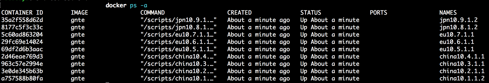

# GNTE
GNTE(Global Network Topology Emulator) is a docker-based all-in-one unstable global network emulator. It emulates functionality such as random delay and packet loss.

## Before Use
Install docker

## Build and Run
### 1. build docker image
Clone this repo and run `build.sh`. There should be an image named `ns` in your docker environment.

### 2. modify network definition file
Edit ```example.yaml``` to fit your requirements. The rules of this file are described in the bottom section.

### 3. generate and launch network emulator
Run the following command:

```
./generate.sh
```

Once all CovenantSQL testnet dockers are running, you can use `docker ps -a` to see all container nodes: 


You can also find a graph of the network in `graph.png` under your root folder:


### 4. stop random one node or all nodes
Run the following command:

```
./generate.sh stopone filter
```

will stop randon one node. If filter is not empty, it will stop node name contains filter.

And there is also a command to stop all:

```
./generate.sh stopall filter
```

Also a command for restart all stopped nodes:

```
./generate.sh startall
```

### 5. run your own program in testnet
Containers are referenced by group_name+ip. For example, given containers 10.250.1.2 and 10.250.8.2, you can run `docker exec -it china10.250.1.2 ping 10.250.8.2` to test the connection between these two networks.

You can replace the `cmd` in the group section of yaml to run your own command. 
The `scripts` dir will be "volumed" to containers.
`docker run --rm -it -v $DIR/scripts:/scripts` you can put your own binaries or scripts here and put your self defined `scripts/my.yaml`: 

```yaml
group:
  - 
    name: china
    nodes:
      - 
        ip: 10.250.1.2
        cmd: "cd /scripts && ./YourBin args"
      - 
        ip: 10.250.1.3
        cmd: "cd /scripts && ./YourBin args"
    delay: "100ms 10ms 30%"
    loss: "1% 10%"
  - 
    name: us
    nodes:
      - 
        ip: 10.250.2.2
        cmd: "cd /scripts && ./YourBin args"
      - 
        ip: 10.250.2.3
        cmd: "cd /scripts && ./YourBin args"
    delay: "1000ms 10ms 30%"
    loss: "1% 10%"
    
network:
  -
    groups:
      - china
      - us
    delay: "200ms 10ms 1%"
    corrupt: "0.2%"
    rate: "10mbit"

```

and run 
```bash
./generate.sh scripts/my.yaml
```

### 5. [optional] clean network
Run `./scripts/clean.sh`

## Modify Network Definition
A sample network description is provided in `example.yaml`, which you can edit directly.

### sample
```yaml
# Only support 10.250.0.2 ~ 10.250.254.254
group:
  -
    name: china
    nodes:
      -
        ip: 10.250.1.2/32
        cmd: "ping -c3 g.cn"
      -
        ip: 10.250.2.2/32
        cmd: "ping -c3 g.cn"
      -
        ip: 10.250.3.2/32
        cmd: "ping -c3 g.cn"
      -
        ip: 10.250.4.2/32
        cmd: "ping -c3 g.cn"
    delay: "100ms 10ms 30%"
    loss: "1% 10%"
  -
    name: eu
    nodes:
      -
        ip: 10.250.5.2/32
        cmd: "ping -c3 g.cn"
      -
        ip: 10.250.6.2/32
        cmd: "ping -c3 g.cn"
      -
        ip: 10.250.7.2/32
        cmd: "ping -c3 g.cn"
    delay: "10ms 5ms 30%"
    loss: "1% 10%"
  -
    name: jpn
    nodes:
      -
        ip: 10.250.8.2/32
        cmd: "ping -c3 g.cn"
      -
        ip: 10.250.9.2/32
        cmd: "ping -c3 g.cn"
    delay: "100ms 10ms 30%"
    duplicate: "1%"
    rate: "100mbit"

network:
  -
    groups:
      - china
      - eu
    delay: "200ms 10ms 1%"
    corrupt: "0.2%"
    rate: "10mbit"

  -
    groups:
      - china
      - jpn
    delay: "100ms 10ms 1%"
    rate: "10mbit"

  -
    groups:
      - jpn
      - eu
    delay: "30ms 5ms 1%"
    rate: "100mbit"

```

## Description
The network definition contains two sections: group and network. Group defines ips and describes network info between them. Network describes network info between groups.

### group
- **name**: unique name of the group

- **nodes**: list of node in the network. 

#### node
- **ip**: Node IP must be between "10.250.0.2 ~ 10.250.254.254" and written in CIDR format, eg. `10.250.1.2/32`.

- **cmd**: Node command to run. Blocking or Non-blocking are both ok.

- **network params**:
The following 6 tc network limit parameters are supported:
    ```
    delay
    loss
    duplicate
    corrupt
    reorder
    rate
    ```
The values of these parameters are exactly like those of the `tc` command.

* `delay: "100ms 10ms 30%"` means 100ms delay in network and 30% packets +-10ms.
* `duplicate: "1%"` means 1% packets is duplicated.
* `rate: "100mbit"` means network transmit rate is 100mbit.
* `corrupt: "0.2%"` means 0.2% packets are randomly modified.

### network
- **groups**: list of group names

- **network params**: same as group
